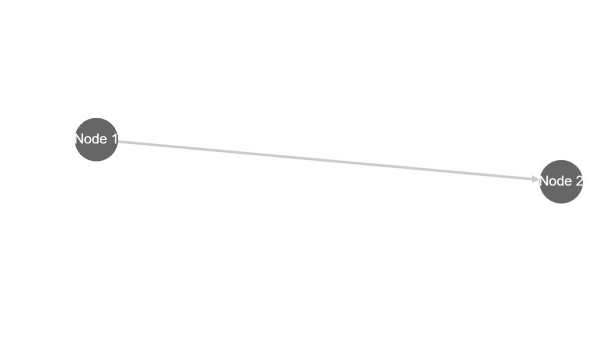
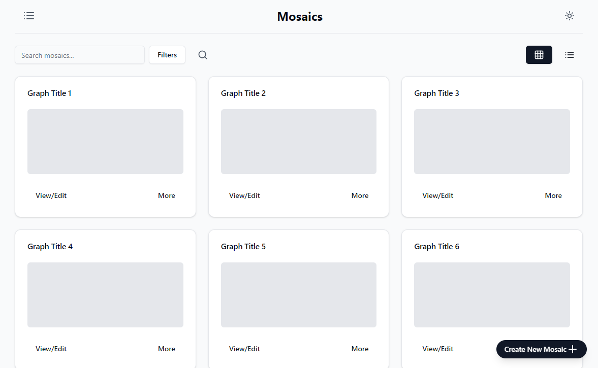
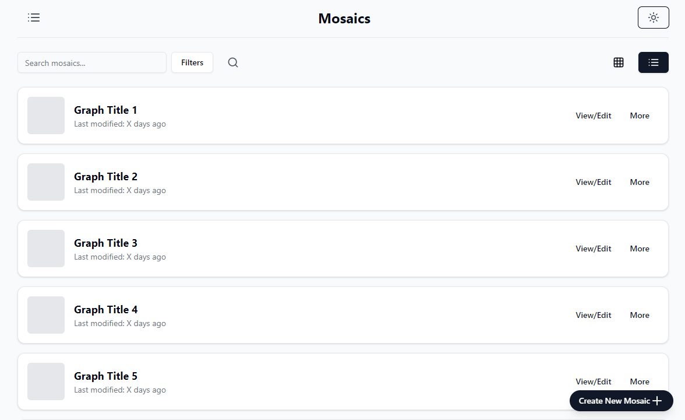

# Mosaic

**DISCLAIMER: THIS IS NOT EVEN A FINISHED PROTOTYPE.**

_But this tool is aimed to be a fully fledged graph editing, information filtering, organizing, managing platform. I plan on developing a graph editor first and then keep going on this project._

Your knowledge, mapped and visualized in one place. Manage it, filter it, visualize it however you want.

## Screenshots

These screenshots are only the prototypes.

Node editing screen:

Mosaics (list of your graphs) page:

Mosaics page in the list form:
